# lid-tooling

<p align="center">
  
</p>



Developer tools for the [LID (Linked-Intent Development)](https://github.com/jszmajda/lid) methodology — keep design intent permanently linked to running code.

LID answers one recurring problem: *you know what the code does, but you've lost track of why it exists and whether it still does what the design said it should.* This tooling enforces the link between requirements, design docs, and code citations — providing two payoffs: **navigation** (intent walkable through your editor) and **attestation** (coherence verifiable by grep). Both work in your editor, your CI pipeline, and your AI workflow.

---

## Tools

| Tool | What it does |
|------|-------------|
| **VS Code extension** | LSP diagnostics, hover, go-to-definition, rename, completion, visual Intent Navigator |
| **IntelliJ IDEA plugin** | LSP diagnostics, hover, go-to-definition, find references, rename, completion, and visual Intent Navigator for all JetBrains IDEs |
| **`lidc` CLI** | `lidc check` for CI, `lidc init` to scaffold new projects, `lidc status` for a quick summary |
| **`lid-mcp` MCP server** | 13 tools so AI agents can read and write LID projects with full integrity guarantees |

---

## Quick start

```sh
# 1. Install (macOS/Linux via Homebrew)
brew tap EtaCassiopeia/lid && brew install lid-tooling

# 2. Scaffold a new LID project
lidc init

# 3. Run coherence checks (use in CI)
lidc check

# 4. See spec coverage
lidc status
```

---

## Documentation

Full documentation: **[etacassiopeia.github.io/lid-tooling](https://etacassiopeia.github.io/lid-tooling)**

| Page | Contents |
|------|---------|
| [Installation](https://etacassiopeia.github.io/lid-tooling/installation) | VS Code Marketplace, JetBrains Marketplace, Homebrew, curl, Windows, from source |
| [VS Code extension](https://etacassiopeia.github.io/lid-tooling/vscode) | LSP features, Intent Navigator, commands, settings |
| [IntelliJ IDEA plugin](https://etacassiopeia.github.io/lid-tooling/intellij) | LSP features, Intent Navigator, actions, settings, plugin signing |
| [`lidc` CLI reference](https://etacassiopeia.github.io/lid-tooling/cli) | Commands, check IDs, exit codes, CI integration |
| [MCP server](https://etacassiopeia.github.io/lid-tooling/mcp) | Configuration, all 13 tools, agent workflow |
| [Project layout](https://etacassiopeia.github.io/lid-tooling/project-layout) | Schema v2, `index.yaml`, spec format, citation format |
| [Contributing](https://etacassiopeia.github.io/lid-tooling/contributing) | Building from source, release pipeline, required secrets |

---

## License

MIT OR Apache-2.0 — see [LICENSE-MIT](LICENSE-MIT) and [LICENSE-APACHE](LICENSE-APACHE).
